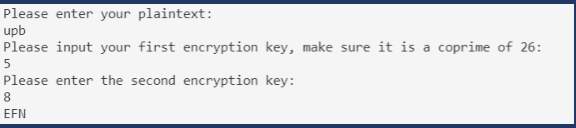
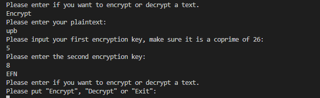

- Nama  : Fery Affandi
- NIM   : 312010018
- kelas : TI.20.A.1
- Mata Kuliah   : Kriptografi 

#
## AffineChiper

Mencoba membuat output AffineChiper seperti gambar dibawah ini:

dengan program Affine Chiper yang ada. Dan berikut adalah hasil dari encryptionnya:

